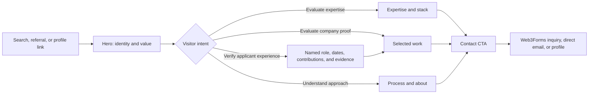
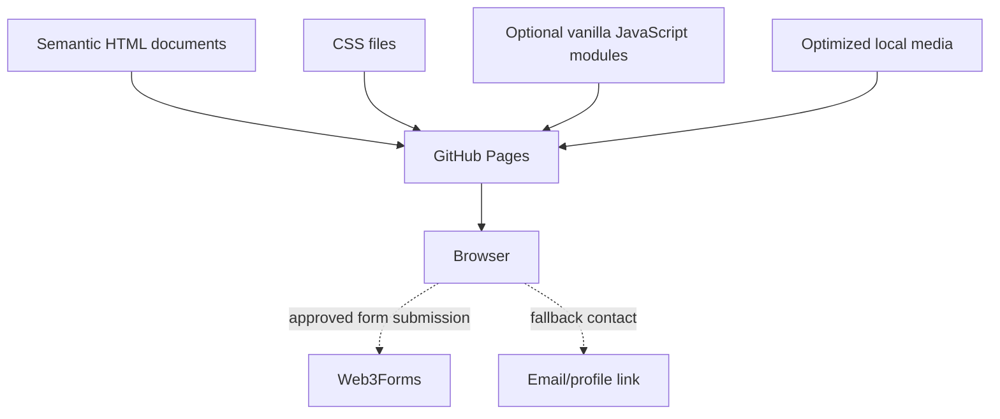
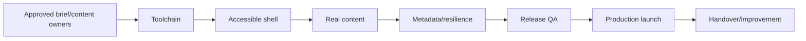

# JRSphere Website — Developer Specification and Delivery Blueprint

> **Status:** Implementation-ready blueprint  
> **Version:** 1.2.0
> **Repository:** `jrspherejrs/website`
> **Target hosting:** GitHub Pages  
> **Primary delivery model:** Static, content-led website
> **Quality target:** WCAG 2.2 AA, excellent Core Web Vitals, repeatable zero-touch deployment

---

## 1. Purpose

This document is the single source of truth for designing, building, testing, deploying, and maintaining the JRSphere website. It turns the desired site into a sequenced delivery plan with explicit architecture, interfaces, content contracts, quality gates, and acceptance criteria.

A developer should be able to execute the project from this document without inventing the architecture. Business copy, approved project facts, contact details, and brand assets must still be supplied by the owner through the content gates defined below.

### 1.1 Product outcome

Build a fast, trustworthy, accessible public website that:

1. explains who or what JRSphere is within five seconds;
2. communicates expertise and services clearly;
3. proves capability through verifiable work and outcomes;
4. gives visitors a direct, low-friction contact path;
5. is discoverable and shareable through correct metadata;
6. works with keyboard, screen reader, touch, mouse, reduced motion, zoom, and constrained networks;
7. deploys automatically and safely to GitHub Pages.

### 1.2 Success indicators

Measure after launch, if privacy-respecting analytics are approved:

- visitors can identify the offering and primary action from the first viewport;
- all critical pages are indexable and return successful status behavior on GitHub Pages;
- contact links work on all supported devices;
- no critical or serious automated accessibility findings;
- Lighthouse mobile targets are met on the deployed production site;
- every deployment can be reproduced from a tagged commit and rolled back through GitHub.

### 1.3 Non-goals for version 1

Unless separately approved, version 1 does **not** include:

- authenticated accounts or a dashboard;
- a database or custom server;
- e-commerce or payment processing;
- a CMS admin interface;
- comments, live chat, or real-time features;
- unapproved tracking, marketing pixels, or cookies;
- a blog with authoring workflow;
- fabricated testimonials, client names, metrics, certifications, or case-study results.

---

## 2. Assumptions, constraints, and decision gates

### 2.1 Current assumptions

| ID | Assumption | Implementation consequence |
|---|---|---|
| A-01 | JRSphere is a hybrid software company building its own products and offering development services. | Present both product and service value without making either audience search for relevance. |
| A-02 | The first production URL is a GitHub **project** site. | Default base path is `/website/`, not `/`. |
| A-03 | The site is primarily English. | Set `lang="en"`; additional languages require a separate localization plan. |
| A-04 | Most content changes are occasional and made through Git. | Keep approved content in semantic HTML with a separate editorial inventory; no CMS in v1. |
| A-05 | There is no custom backend. | Use Web3Forms for the inquiry form with direct email as the always-visible fallback. |
| A-06 | Progressive enhancement is required. | Core reading, navigation, and a fallback contact path work without client JavaScript. |
| A-07 | The repository license is GPL-3.0. | Preserve the existing license and ensure third-party assets are license-compatible. |
| A-08 | Clients, hiring teams, and academic admissions committees are primary evaluators. | Case studies must distinguish company output from each named contributor’s role, dates, responsibilities, and evidence. |

### 2.2 Owner decision register

Record architecture consequences in Section 24. “Proposed” items may use the stated default during foundation work but require approval before content freeze.

| Gate | Required decision | Direction | Status |
|---|---|---|---|
| D-01 | Brand subject | Hybrid software company: own products plus development services | Confirmed |
| D-02 | Primary conversion | Project inquiry form with direct email fallback | Confirmed |
| D-03 | Production URL | `https://jrspherejrs.github.io/website/` | Confirmed |
| D-04 | Public contact details | `jrsphere.jrs@gmail.com`; approved profiles still pending | Partially confirmed |
| D-05 | Sections | Use the v1 information architecture in Section 5 | Proposed |
| D-06 | Case studies | Feature JRSphere Office Platform first; additional projects may follow | Partially confirmed; project facts/assets pending |
| D-07 | Analytics | None | Proposed default |
| D-08 | Theme | Light and dark, following system preference | Proposed default |
| D-09 | Brand assets | Text wordmark until licensed logo/imagery is supplied | Proposed default |
| D-10 | Contact form | Web3Forms with accessible native form behavior and email fallback | Selected; access key and privacy approval pending |
| D-11 | Academic evidence attribution | Collective/team ownership; do not claim a sole owner. Name each applicant/contributor and their individual role, dates, and responsibilities. | Partially confirmed; public names and roles pending |
| D-12 | Project status | Deployed privately; no public live URL | Confirmed |

### 2.3 Content truth rule

No developer may invent personal information, client names, employment history, awards, statistics, testimonials, or business outcomes. Missing optional content causes the relevant pattern or section to be omitted cleanly. Missing required content blocks launch.

---

## 3. Users and journeys

### 3.1 Primary audiences

| Audience | Need | Evidence required | Desired action |
|---|---|---|---|
| Hiring manager or recruiter | Quickly assess company capability and a named contributor’s skills and experience | Selected work, role, stack, dates, outcomes, résumé/profile | Start a conversation |
| Potential client | Understand services and delivery confidence | Capabilities, process, proof, availability | Send a project inquiry |
| Academic admissions committee | Verify that claimed work demonstrates relevant, attributable experience | Named applicant, role, dates, responsibilities, artifacts, repository history, and outcomes | Evaluate the application with credible evidence |
| Engineering peer | Assess technical depth and approach | Architecture decisions, code links, project detail | Explore work or connect |
| Search/social visitor | Understand context immediately | Clear title, description, social preview | Continue into the site |
| Assistive-technology user | Access the same content and actions | Semantic structure, labels, focus, alternatives | Complete any journey independently |

### 3.2 Golden-path journey



### 3.3 Journey requirements

- The logo/wordmark returns to the top of the page.
- The primary call to action is visible in the first viewport at common mobile and desktop sizes.
- Every major section has a stable, readable fragment ID.
- Desktop and mobile navigation expose the same destinations.
- Contact is reachable from hero, header, and final call-to-action area.
- A visitor never has to interact with animation, a carousel, or a hidden gesture to read core content.

---

## 4. Scope

### 4.1 Version 1 deliverables

1. Responsive static website.
2. Design tokens and reusable HTML/CSS pattern system.
3. Approved copy and optimized assets.
4. SEO metadata, canonical URL, robots policy, sitemap, structured data, and social card.
5. Accessible navigation, section landmarks, controls, and contact paths.
6. JavaScript checks where behavior exists, end-to-end smoke tests, automated accessibility checks, and Lighthouse audits.
7. GitHub Actions workflows for CI and GitHub Pages deployment.
8. Setup, content editing, deployment, and rollback documentation.
9. Production QA evidence and an acceptance checklist.

### 4.2 Progressive enhancement backlog

Only begin these after all v1 acceptance criteria pass:

- detailed case-study routes;
- writing/blog collection and RSS feed;
- localized content;
- privacy-respecting analytics;
- CRM, scheduling, or advanced inquiry automation beyond the v1 Web3Forms flow;
- downloadable résumé, only if a current accessible PDF is provided;
- theme override control persisted in local storage.

---

## 5. Information architecture and page specification

### 5.1 Route map

| Route | Purpose | Indexing | Priority |
|---|---|---:|---:|
| `/website/` | Main website and all v1 content | Index | P0 |
| `/website/privacy/` | Explain Web3Forms processing and contact-data handling | Index | P0 |
| `/website/thanks/` | Successful inquiry confirmation and next steps | Noindex | P0 |
| `/website/404.html` | Branded not-found recovery | Noindex | P0 |
| `/website/work/[slug]/` | Future detailed case study | Index when complete | P2 |

If a custom domain is adopted, replace `/website/` with `/` through configuration. No static document should assume an unreviewed deployment path.

### 5.2 Main-page section order

| Order | Section | Stable ID | Required | Goal |
|---:|---|---|---:|---|
| 1 | Site header | `top` | Yes | Identity, navigation, primary action |
| 2 | Hero | `home` | Yes | State who JRSphere is, what value is offered, and next action |
| 3 | Trust/proof strip | `proof` | Conditional | Show only approved, verifiable evidence |
| 4 | About | `about` | Yes | Concise positioning and working principles |
| 5 | Expertise/services | `expertise` | Yes | Explain capability in outcome-oriented language |
| 6 | Selected work | `work` | Conditional | Demonstrate role, constraints, solution, and outcome |
| 7 | Delivery process | `process` | Yes | Reduce uncertainty about collaboration |
| 8 | Technology | `stack` | Yes | Show categorized, relevant tools without an icon wall |
| 9 | Final contact CTA | `contact` | Yes | Provide direct and accessible next steps |
| 10 | Footer | — | Yes | Copyright, profiles, source/license, back-to-top |

### 5.3 Header

**Content**

- text or SVG JRSphere wordmark;
- links to About, Expertise, Work when present, Process, and Contact;
- visually distinct primary contact action;
- optional theme button only after theme behavior is fully accessible.

**Behavior**

- sticky after scrolling is permitted, but must not obscure focused content;
- anchor navigation must account for header height with `scroll-margin-top`;
- current section indication is optional; if implemented, use `aria-current="location"` and do not rely on color alone;
- mobile menu button must expose `aria-expanded`, `aria-controls`, and an accessible name;
- Escape closes the mobile menu; focus returns to the trigger;
- do not trap focus in a simple disclosure menu;
- navigation must remain available when JavaScript fails. Prefer CSS-responsive inline navigation over a JS-only drawer.

### 5.4 Hero

Required content contract:

- eyebrow or role, maximum 50 characters;
- single `<h1>`, recommended 35–80 characters;
- value statement, recommended 100–220 characters;
- primary CTA to Contact;
- secondary CTA to Work, or Expertise when Work is unavailable;
- optional approved availability statement;
- optional decorative visual that does not displace the message.

Rules:

- no typewriter animation;
- no auto-playing media;
- do not render decorative text as an image;
- hero visual must be hidden from assistive technology if decorative;
- keep key copy in HTML and usable before fonts or scripts load.

### 5.5 Proof strip

Show only when at least one verified item exists. Valid proof includes:

- years or project count with an approved calculation/source;
- recognizable specialties;
- client/partner logos with written usage rights;
- certification with exact name and current status;
- concise testimonial with permission and attribution.

Omit this section instead of using weak placeholders such as “100% satisfaction.”

### 5.6 About

Include:

- 1–3 short paragraphs;
- specialization and the problems addressed;
- principles such as accessibility, maintainability, performance, and collaboration, if true;
- optional portrait with useful alt text; use empty alt only when the image adds no information;
- optional résumé/profile link.

Use prose width of approximately 60–75 characters. Avoid a biography wall.

### 5.7 Expertise/services

Use three to six cards. Each card follows this content contract:

| Field | Required | Rule |
|---|---:|---|
| Title | Yes | Concise service or expertise name |
| Summary | Yes | Outcome-oriented explanation |
| Capabilities | Yes | Semantic list containing 2–5 concise items |
| Icon | No | Decorative only; never the accessible label |

Each card answers:

1. What is offered?
2. What user or business problem does it solve?
3. What concrete activities are included?

Cards are articles or list items, not clickable containers, unless each has a real destination.

### 5.8 Selected work

Render two to four projects when approved. Each project follows this content contract:

| Field | Required | Rule |
|---|---:|---|
| Slug | Yes | Lowercase, stable, URL-safe identifier |
| Title | Yes | Approved project name |
| Summary | Yes | Concise factual overview |
| Status | Yes | Prototype, active development, privately deployed, publicly live, or completed |
| Period | Yes | Start month and end month, or explicitly ongoing |
| Contributors | Yes | Names, roles, and personal responsibilities approved for publication |
| Challenge | Yes | Verified problem or constraint |
| Approach | Yes | Factual implementation approach |
| Outcomes | Yes | Verified statements with evidence where available |
| Technologies | Yes | Semantic text list |
| Image | No | Local path, alt text, width, and height |
| Live URL | No | Public destination only |
| Source URL | No | Public repository only |
| Featured | Yes | Editorial decision represented by placement, not client-side data |

Rules:

- outcome claims must be measurable or carefully qualitative and verifiable;
- show the project’s current status and do not present active development as a completed or production system;
- clearly state the company’s role and each named contributor’s personal role, period, and responsibilities, especially for academic or employment verification;
- link claims to permissible evidence such as repository history, pull requests, architecture records, screenshots, releases, or live demonstrations;
- use descriptive link labels, for example “View Acme accessibility redesign,” not “Learn more”;
- external links identify that they open an external destination; opening a new tab is not the default;
- do not expose private repository links;
- screenshots must not include secrets, private data, or unlicensed material;
- omit absent URLs instead of showing disabled controls.

If there are no approved projects, remove the Work navigation item and section; strengthen Expertise and Process. Never ship placeholder projects.

#### 5.8.1 Confirmed first project record

Use the following only as a starting record; unresolved fields block publication of the case study:

| Field | Confirmed value |
|---|---|
| Name | JRSphere Office Platform |
| Public description | Internal enterprise management system |
| Source | `https://github.com/JRSphere/jrs-platform` |
| Visible implementation | TypeScript monorepo with a Next.js web application and NestJS API |
| Status | Privately deployed; not publicly accessible |
| Ownership model | Collective/team ownership; do not identify a sole owner |
| Named contributor/applicant | **Open decision D-11**; public names pending |
| Role, dates, responsibilities | **Open decision D-11**; per-person attribution pending |
| Outcomes and evidence | Pending factual content review |
| Live URL | Private; do not publish or imply public access |
| Screenshots | Not supplied; sanitize any future internal screenshots |

The website may state that the platform is privately deployed because the owner confirmed that status. It must not claim public availability, user numbers, commercial results, team size, completed scope, or a named person’s contribution until those facts are separately approved.

### 5.9 Delivery process

Recommended four-step model:

1. **Discover** — goals, users, constraints, content, and success measures.
2. **Design** — architecture, content hierarchy, interaction, and review.
3. **Build and validate** — incremental implementation with automated and manual checks.
4. **Launch and improve** — production QA, monitoring, handover, and measured iteration.

Each step needs one outcome-focused sentence. Use an ordered list semantically.

### 5.10 Technology section

Group relevant technologies into categories such as:

- Frontend;
- Backend/platform;
- Quality and accessibility;
- Delivery and operations.

Requirements:

- technology names remain text, even when icons are used;
- icons are decorative;
- list only tools JRSphere can discuss credibly;
- avoid proficiency percentages or progress bars.

### 5.11 Contact

Required:

- direct, specific invitation for project, employment, or academic-verification inquiries;
- accessible inquiry form submitted to Web3Forms;
- always-visible fallback email link to `jrsphere.jrs@gmail.com`;
- optional approved profile links;
- expected response statement only if it can be honored;
- concise notice linking to `/privacy/` before submission.

Web3Forms is a strong technical fit for this static GitHub Pages site because it accepts client-side HTML form submissions without a custom backend. It is still an external data processor, not part of JRSphere. Version 1 must:

- post to `https://api.web3forms.com/submit` using an owner-generated access key;
- treat the access key as public configuration rather than a secret; it is visible in the delivered form by design;
- include fields for name, email, organization/institution, inquiry type, and message;
- use real `<label>` elements, suitable autocomplete tokens, clear instructions, native constraints, and text errors;
- use a hidden fixed subject and include the Web3Forms `botcheck` honeypot;
- redirect successful non-JavaScript submissions to the absolute production `/website/thanks/` URL;
- retain entered values when client-side validation fails;
- provide visible pending, success, rate-limit, provider-failure, and offline states if JavaScript enhancement is added;
- never make JavaScript the only submission path;
- keep the direct email fallback visible before and after any provider failure;
- avoid CAPTCHA at launch; add an accessibility-reviewed challenge only if measured spam makes it necessary;
- verify submission from the production GitHub Pages origin;
- disclose that submissions are processed by Web3Forms, whose published documentation states processing occurs on US-East servers and that server logs containing personal information may be retained for up to two months;
- obtain owner approval for the privacy notice and processor choice before enabling the production form.

The form must not request sensitive academic records, identity documents, passwords, payment details, health data, or other unnecessary personal information.

Provider references to re-check during implementation:

- [Web3Forms API reference](https://docs.web3forms.com/getting-started/api-reference)
- [Web3Forms access-key and privacy FAQ](https://docs.web3forms.com/getting-started/faq)

### 5.12 Footer

Include:

- `© {current year} JRSphere` or approved legal name;
- approved profile links;
- repository/source link if desired;
- license link;
- back-to-top link.

Use an approved literal copyright year and review it annually. The footer must not depend on JavaScript.

### 5.13 404 page

- same brand and visual language as the main page;
- one `<h1>` explaining that the page was not found;
- link to the deployment base/home;
- `noindex` directive;
- no script dependency;
- tested under the GitHub project path.

---

## 6. Content package and governance

### 6.1 Required content inventory

The owner must provide this before the content-complete milestone:

- approved company display name and legal/copyright name;
- company positioning line and service/product model;
- hero heading and value proposition;
- short and long descriptions for SEO and page copy;
- About copy;
- named founder/applicant/contributor profile where academic experience must be verified;
- role title, start/end dates, responsibilities, and attribution evidence for that person;
- three to six expertise entries;
- process wording or approval of the recommended model;
- technology list;
- approved contact email (`jrsphere.jrs@gmail.com`) and profile URLs;
- owner-generated Web3Forms access key and approved privacy wording;
- approved JRSphere Office Platform status, role, dates, evidence, and screenshots where available;
- up to three additional projects, if Work is included;
- logo/wordmark, team/contributor portrait, project images, and social image, or approval to create non-deceptive brand graphics;
- written asset licenses and credits where required.

### 6.2 Copy limits

| Content | Target |
|---|---:|
| SEO title | 30–60 characters |
| Meta description | 120–160 characters |
| Hero heading | 35–80 characters |
| Hero body | 100–220 characters |
| Section introduction | 80–240 characters |
| Expertise summary | 80–180 characters |
| Project summary | 100–220 characters |
| Button/CTA | 2–5 words |
| Image alt text | Usually under 150 characters; describe purpose, not appearance alone |

These are editorial targets, not hard truncation limits. CSS must never cut off essential text.

### 6.3 Content storage

Version 1 content is authored directly in semantic HTML so that search engines, assistive technology, and script-disabled browsers receive the complete page without a rendering or build step.

Maintain the approved source copy separately from presentation work:

```text
docs/
└── content-inventory.md     # editorial source, evidence, approval state, and asset provenance
```

Rules:

- `docs/content-inventory.md` is not part of the published Pages artifact;
- approved copy is transferred into the relevant HTML document;
- core content must not be fetched from JSON or injected by JavaScript;
- repeated site-wide content is deliberately reviewed across the small v1 page set;
- a CMS or static-site generator requires a future architecture decision and is not part of v1.

### 6.4 Editorial rules

- Use plain language and active voice.
- Lead with outcomes; support with technologies.
- Avoid unexplained acronyms.
- Use sentence case for headings and controls.
- Keep punctuation and spelling consistent.
- Mark code, product names, and technical terms correctly.
- Do not use ampersands as a general replacement for “and.”
- Confirm link text still makes sense out of context.
- Run a final legal/factual/brand approval before launch.

---

## 7. Experience blueprint and responsive behavior

### 7.1 Low-fidelity page blueprint

```text
┌────────────────────────────────────────────────────────────┐
│ Skip link                                                  │
│ JRSphere       About Expertise Work Process   [Contact]    │
├────────────────────────────────────────────────────────────┤
│ Role / positioning                                         │
│ One clear H1 that communicates value        Brand visual   │
│ Supporting statement                                       │
│ [Primary CTA] [Secondary CTA]                              │
├────────────────────────────────────────────────────────────┤
│ Optional verified proof                                    │
├────────────────────────────────────────────────────────────┤
│ About                       Concise narrative / portrait     │
├────────────────────────────────────────────────────────────┤
│ Expertise                    3–6 responsive cards            │
├────────────────────────────────────────────────────────────┤
│ Selected work                2–4 evidence-led project cards  │
├────────────────────────────────────────────────────────────┤
│ Process                      Ordered four-step path           │
├────────────────────────────────────────────────────────────┤
│ Technology                   Categorized text lists           │
├────────────────────────────────────────────────────────────┤
│ Contact                      Direct CTA and approved links    │
├────────────────────────────────────────────────────────────┤
│ Copyright / profiles / license / back to top                │
└────────────────────────────────────────────────────────────┘
```

On narrow screens, all visual columns become a logical single-column reading order. The DOM order must already be the correct reading order; do not use CSS reordering to create a different meaning.

### 7.2 Breakpoint strategy

Use content-driven CSS, not device-specific layouts.

| Range | Expected behavior |
|---|---|
| `0–39.99rem` | Single column, compact navigation, full-width primary actions when helpful |
| `40–63.99rem` | Wider spacing; two-column cards where content permits |
| `64rem+` | Full navigation; two-column hero/about; up to three project/expertise columns |

Breakpoints are implementation starting points. Adjust only when content visually breaks. Support down to 320 CSS pixels without horizontal scrolling at 400% browser zoom/reflow.

### 7.3 Interaction states

Every interactive element needs:

- default;
- hover, only as enhancement;
- visible keyboard focus;
- active/pressed where appropriate;
- disabled only when unavoidable;
- loading/success/error for asynchronous behavior.

Minimum pointer target: 24×24 CSS pixels under WCAG 2.2, with a project preference of at least 44×44 pixels for primary controls.

### 7.4 Motion

- Use motion only to explain state or reinforce hierarchy.
- Keep non-essential transitions approximately 150–250 ms.
- Do not animate large areas on initial load.
- Disable non-essential movement under `prefers-reduced-motion: reduce`.
- Smooth scrolling must be disabled for reduced motion and must never prevent fragment navigation.

---

## 8. Visual design system

### 8.1 Direction

The intended direction is precise, modern, technical, and human—not a generic neon “developer” template. Favor generous space, strong typography, restrained blue/cyan accents, subtle grid or orbital references to the “sphere” identity, and clear evidence-led cards.

Avoid:

- low-contrast gray-on-gray copy;
- excessive glassmorphism;
- animated star fields, code rain, parallax, or cursor effects;
- gradients behind body text;
- large icon walls;
- stock photos presented as the owner;
- animation that delays content.

### 8.2 Token architecture

Define semantic custom properties in `assets/css/tokens.css`. The following is a starting contract, not final art direction:

```css
:root {
  color-scheme: light dark;

  --color-bg: #f7f9fc;
  --color-surface: #ffffff;
  --color-surface-raised: #eef4ff;
  --color-text: #101828;
  --color-text-muted: #475467;
  --color-brand: #155eef;
  --color-brand-strong: #004eeb;
  --color-accent: #06aed4;
  --color-border: #d0d5dd;
  --color-focus: #ffbf47;
  --color-danger: #b42318;

  --font-sans: "Inter Variable", Inter, ui-sans-serif, system-ui, sans-serif;
  --font-mono: "IBM Plex Mono", ui-monospace, SFMono-Regular, monospace;

  --step--1: clamp(0.875rem, 0.84rem + 0.12vw, 0.95rem);
  --step-0: clamp(1rem, 0.95rem + 0.2vw, 1.125rem);
  --step-1: clamp(1.25rem, 1.1rem + 0.6vw, 1.6rem);
  --step-2: clamp(1.6rem, 1.3rem + 1.1vw, 2.25rem);
  --step-3: clamp(2.1rem, 1.6rem + 2vw, 3.5rem);
  --step-4: clamp(2.7rem, 1.8rem + 3.2vw, 5rem);

  --space-1: 0.25rem;
  --space-2: 0.5rem;
  --space-3: 0.75rem;
  --space-4: 1rem;
  --space-6: 1.5rem;
  --space-8: 2rem;
  --space-12: 3rem;
  --space-16: 4rem;
  --space-24: 6rem;

  --radius-sm: 0.5rem;
  --radius-md: 0.875rem;
  --radius-lg: 1.5rem;
  --shadow-sm: 0 1px 2px rgb(16 24 40 / 0.06);
  --shadow-md: 0 12px 32px rgb(16 24 40 / 0.1);
  --content-max: 75rem;
  --text-max: 70ch;
}
```

For dark mode, remap semantic tokens in `@media (prefers-color-scheme: dark)`; do not override colors component by component. Validate all theme/state combinations for contrast.

### 8.3 Typography

- Use at most one variable sans family and one optional mono family.
- Prefer system fonts for the first implementation; add self-hosted WOFF2 only when approved and licensed.
- Do not fetch Google Fonts at runtime.
- Body line-height: approximately 1.6.
- Heading line-height: approximately 1.05–1.25.
- Never disable browser text-size adjustment.
- Avoid body copy below 16px equivalent.

### 8.4 Layout primitives

Implement small, reusable CSS layout patterns:

- `.container` — max width and inline gutter;
- `.section` — consistent block rhythm and optional tone;
- `.stack` — vertical rhythm;
- `.cluster` — wrapping inline group;
- `.grid` — auto-fit cards with a safe minimum;
- `.button` — anchors or buttons styled consistently without changing their native semantics;
- `.tag-list` — semantic list of labels.

Use native CSS Grid/Flexbox and logical properties. Do not use CSS-in-JS or a runtime styling dependency.

### 8.5 Asset rules

- SVG for marks and simple illustrations; sanitize and optimize source.
- AVIF or WebP for photography/screenshots with a fallback only where required by the agreed browser matrix.
- Always include intrinsic `width` and `height` or `aspect-ratio`.
- Hero/LCP asset is eagerly loaded and may use `fetchpriority="high"` only after measurement.
- Below-the-fold images use native lazy loading.
- Keep meaningful image text legible and duplicate essential information in HTML.
- Store original design assets outside the deployment bundle if they are not used by the site.

---

## 9. Technical architecture

### 9.1 Architecture decision

Use **HTML5, CSS3, and vanilla JavaScript** as the complete production web stack. The repository stores the same static files that GitHub Pages serves. There is no framework, transpiler, template compiler, package runtime, or production build step.

Why this fits:

- it matches the approved technology specification exactly;
- GitHub Pages serves static files directly;
- semantic content is present in HTML before CSS or JavaScript loads;
- CSS custom properties, Grid, Flexbox, and media queries provide the required design system and responsive behavior;
- native ES modules support the small amount of optional interaction without a framework;
- fewer moving parts reduce maintenance, supply-chain, performance, and deployment risk.

Development-only validation tools may be proposed separately for approval. They must never become necessary for the production site to render or function.

### 9.2 Runtime model



There is no JRSphere-hosted production Node server, API, package runtime, secret, or database. The only v1 external write operation is the reviewed Web3Forms submission endpoint.

### 9.3 Repository structure

```text
.
├── .github/
│   ├── workflows/
│   │   ├── ci.yml
│   │   └── deploy-pages.yml
│   └── pull_request_template.md
├── assets/
│   ├── css/
│   │   ├── reset.css
│   │   ├── tokens.css
│   │   └── main.css
│   ├── icons/
│   │   ├── favicon.svg
│   │   └── apple-touch-icon.png
│   ├── images/
│   │   ├── brand/
│   │   ├── og/
│   │   │   └── jrsphere-default.png
│   │   └── work/
│   └── js/
│       ├── main.js
│       └── modules/                 # create only when an approved interaction needs it
├── docs/
│   └── content-inventory.md         # excluded from the deployment artifact
├── privacy/
│   └── index.html
├── thanks/
│   └── index.html
├── tests/                           # development-only checks after separate tool approval
│   └── e2e/
├── .editorconfig
├── .gitignore
├── .nojekyll
├── 404.html
├── index.html
├── robots.txt
├── sitemap.xml
├── README.md
├── SECURITY.md
└── JRSphere-Developer-Specification.md
```

Do not create empty directories or placeholder files until the relevant phase starts.

### 9.4 Static configuration contract

There is no runtime environment-variable or build-time configuration layer in v1. Public configuration is explicit and reviewable in source:

| Value | Production value | Source location |
|---|---|---|
| Site origin | `https://jrspherejrs.github.io` | Canonical, social metadata, sitemap |
| Project base | `/website/` | Internal route and asset-path review |
| Contact email | `jrsphere.jrs@gmail.com` | Visible HTML contact fallback |
| Web3Forms endpoint | `https://api.web3forms.com/submit` | Contact form `action` |
| Web3Forms access key | Owner-generated public UUID | Hidden form input after activation approval |

The Web3Forms key is public by provider design. With no build step, the approved key is placed directly in the HTML form. A placeholder key blocks deployment; it must never silently produce a broken production form.

### 9.5 URL and asset rules

- use document-relative URLs for local assets and routes so pages work under `/website/`;
- do not use origin-root asset URLs such as `/assets/main.css` on the GitHub project site;
- the home page uses paths such as `assets/css/main.css` and `privacy/`;
- nested pages use paths such as `../assets/css/main.css` and `../`;
- canonical, Open Graph, sitemap, and Web3Forms redirect URLs use absolute production URLs;
- fragment links target unique IDs in `index.html`;
- test the exact static artifact mounted at `/website/`, not only at `/`;
- a future custom-domain migration must review every absolute production URL and relative route.

### 9.6 Dependency and JavaScript rules

- production has no package dependencies and requires no package manager;
- use HTML and CSS before JavaScript;
- use native ES modules and browser APIs when JavaScript is justified;
- do not ship a component framework, utility runtime, icon library, polyfill bundle, or third-party script by default;
- keep scripts local, deferred by module semantics, small, and organized by responsibility;
- the page, navigation, content, email fallback, and native form submission remain usable when JavaScript is unavailable;
- development-only QA tools require a separate approval, documented purpose, reproducible versioning, and license/security review;
- generated development artifacts are excluded from the published site.

### 9.7 Browser support

Support current stable and previous major releases of:

- Chrome/Edge;
- Firefox;
- Safari on macOS;
- Safari on iOS;
- Chrome on Android.

Core content and navigation must remain usable in older or script-disabled browsers. Progressive effects may degrade.

---

## 10. HTML pattern contracts

### 10.1 General contract

Every repeated HTML pattern must:

- have one clear responsibility;
- use semantic native elements first;
- keep factual content in HTML;
- use the semantic design tokens and layout classes;
- support long text and missing optional content;
- avoid duplicate IDs;
- produce valid HTML;
- remain understandable without CSS and usable without JavaScript.

Because v1 has no template compiler, repeated header, footer, and metadata changes must be reviewed across every HTML page in the same pull request.

### 10.2 Document shell contract

Every HTML document contains:

- `<!doctype html>` and the approved language;
- charset and responsive viewport metadata;
- unique title and description;
- canonical URL and route-appropriate robots directive;
- Open Graph and X/Twitter metadata where indexable;
- icons and theme color;
- valid JSON-LD where applicable;
- skip link on content pages;
- labeled header/navigation, one main landmark, and footer;
- shared CSS links using the correct relative path;
- route-appropriate JavaScript only when required.

A release check compares all page shells to prevent stale metadata, navigation, privacy links, or asset paths.

### 10.3 Button-link rule

Use `<a>` for navigation and `<button>` for actions that change state. Never add click handlers to non-interactive elements. The `.button` class may style either native element but must not change its semantics.

### 10.4 Card rule

Do not make an entire card clickable by wrapping complex nested content in an anchor. Prefer a clear named link inside. If a stretched-link pattern is approved, verify selection, focus, nested links, and screen-reader behavior.

---

## 11. SEO and discoverability

### 11.1 Required metadata

For every indexable route:

- unique `<title>`;
- unique meta description;
- self-referencing canonical URL;
- Open Graph title, description, type, URL, and absolute image URL;
- X/Twitter card metadata;
- meaningful social image at 1200×630;
- favicon and touch icon;
- correct language;
- index/follow intent.

Do not add obsolete `keywords` metadata.

### 11.2 Heading and document structure

- exactly one page-level `<h1>`;
- logical, non-skipped hierarchy where possible;
- one `<main>`;
- labeled `<nav>` elements when more than one exists;
- section headings for all major sections;
- lists rendered as lists;
- contact information may use `<address>` where semantically appropriate.

### 11.3 Structured data

Emit JSON-LD from the approved brand model:

- `WebSite` for the site;
- `Organization` for JRSphere, using only approved company identity fields;
- `Person` for a founder, employee, or applicant only after their public name and relationship to JRSphere are approved;
- use a truthful relationship such as `founder`, `employee`, or `member`; do not imply employment or incorporation status without evidence;
- `sameAs` only for approved profiles owned by the relevant company or person.

Rules:

- structured data must match visible page content;
- do not declare ratings, reviews, occupation, address, or credentials that are not visible and verified;
- validate with Schema.org tooling and a search rich-results test where applicable.

### 11.4 Sitemap and robots

- maintain sitemap entries for canonical production routes;
- do not include `404.html`, drafts, or noindex pages;
- a root-domain `robots.txt` can advertise the sitemap;
- on a GitHub project site, remember `robots.txt` is origin-root scoped and may be controlled by the owner site. Do not assume `/website/robots.txt` controls crawling;
- verify the sitemap URLs include the project base path.

### 11.5 Search release checks

- production is not blocked by `noindex`;
- staging/preview URLs are not submitted for indexing;
- canonical URLs do not point to localhost or branch previews;
- metadata has no placeholder content;
- social preview works when fetched anonymously;
- custom-domain migration includes canonical, sitemap, and repository Pages updates in the same release.

---

## 12. Accessibility specification

Target **WCAG 2.2 Level AA**. Automated tools are required but do not replace manual testing.

### 12.1 Structure and navigation

- first focusable element is a visible-on-focus “Skip to main content” link;
- landmark structure is coherent;
- focus order follows reading order;
- fragment targets are not hidden behind sticky header;
- there are no keyboard traps;
- current/expanded states are programmatic;
- the page title describes the route.

### 12.2 Keyboard and focus

- all functions work with keyboard alone;
- focus indicator has sufficient contrast and is never globally removed;
- focus is not obscured by sticky UI;
- Escape closes dismissible overlays/disclosures;
- after route-like UI changes, focus behavior is deliberate and tested;
- target size and spacing meet WCAG 2.2.

### 12.3 Color and display

- normal text contrast at least 4.5:1;
- large text contrast at least 3:1;
- UI component and meaningful graphical object contrast at least 3:1;
- information does not rely on color alone;
- content works at 200% text resize;
- content reflows at 400% zoom/320 CSS pixel viewport without two-dimensional scrolling, except legitimate data/code exceptions;
- forced-colors/high-contrast behavior is tested.

### 12.4 Images and media

- informative images have concise purpose-oriented alternatives;
- decorative images have `alt=""` or CSS treatment;
- logos have an accessible name once, without redundant “image of” phrasing;
- no text-of-record is only in an image;
- video/audio, if later added, requires captions/transcripts and no autoplay.

### 12.5 Forms

If a form is introduced:

- every input has a persistent visible label;
- instructions appear before they are needed;
- related controls use fieldset/legend;
- autocomplete tokens are correct;
- required state is conveyed in text and programmatically;
- error summary links to invalid fields;
- field errors describe how to fix the issue;
- status messages are announced without stealing focus unnecessarily;
- timeout or data-loss behavior does not exist or is communicated and recoverable.

### 12.6 Motion and cognition

- honor reduced motion;
- avoid flashing content;
- no time-limited interactions;
- labels remain consistent;
- navigation order remains consistent;
- icons are never the only label for unfamiliar actions.

### 12.7 Manual assistive-technology matrix

Minimum before release:

| Platform | Browser/AT | Critical journeys |
|---|---|---|
| Windows | NVDA + Firefox or Chrome | Read landmarks/headings, navigation, project links, contact |
| macOS | VoiceOver + Safari | Same golden path |
| iOS | VoiceOver + Safari | Mobile menu/navigation, sections, contact |
| Keyboard only | Current desktop browsers | Entire site, visible focus, skip link, no trap |
| Zoom/low vision | 200% text and 400% zoom | Reflow, no clipping, fixed content does not obscure focus |

---

## 13. Performance specification

### 13.1 Production budgets

Measured on a clean production static artifact, compressed over the network:

| Budget | Target |
|---|---:|
| Initial HTML | ≤ 50 KB |
| Initial route CSS | ≤ 40 KB |
| Initial route client JavaScript | ≤ 30 KB; target 0–10 KB |
| LCP/hero image | ≤ 180 KB |
| Total initial page transfer | ≤ 600 KB |
| Third-party scripts | 0 by default |
| Fonts | ≤ 100 KB total, ideally 0 external font bytes |
| Lighthouse Performance | ≥ 95 mobile lab score |
| Lighthouse Accessibility | 100 target, never below 95 with no serious issues |
| Lighthouse Best Practices | ≥ 95 |
| Lighthouse SEO | ≥ 95 |

Budgets are ceilings, not goals to fill.

### 13.2 Core Web Vitals targets

At the 75th percentile of real-user data when enough traffic exists:

- LCP ≤ 2.5 seconds;
- INP ≤ 200 milliseconds;
- CLS ≤ 0.1.

Lab tests approximate these but do not guarantee field results.

### 13.3 Implementation requirements

- static HTML for all primary content;
- reserve media dimensions to prevent layout shift;
- no render-blocking third-party script;
- inline only truly tiny critical code; preserve CSP/custom-domain considerations for future hosting;
- self-host and subset fonts only if they add measurable brand value;
- use `font-display: swap` or `optional`;
- lazy-load only below-the-fold imagery;
- do not lazy-load the LCP image;
- avoid preloading resources without evidence;
- use SVG/CSS rather than large raster decoration;
- test with a cold cache and network throttling.

---

## 14. Security, privacy, and resilience

### 14.1 Static-site security model

- no secrets in HTML, CSS, JavaScript, repository history, deployment configuration, or action logs;
- pin GitHub Actions to trusted major releases at minimum; for hardened environments, pin full commit SHAs and automate review;
- grant workflow permissions explicitly and minimally;
- do not execute untrusted pull-request code with write tokens;
- sanitize any third-party SVG/HTML before committing;
- use `rel="noopener noreferrer"` where a new browsing context is intentionally opened;
- validate outbound URLs in content review;
- enable Dependabot and repository security alerts.

GitHub Pages does not provide arbitrary response-header control. Do not claim CSP, HSTS customization, or other custom security headers unless a custom proxy/CDN is added and tested. Prefer architecture that remains safe without those headers.

### 14.2 Privacy

- no analytics by default;
- no unnecessary cookies or local storage;
- external embeds require explicit review because they can leak visitor data;
- link to external profiles normally instead of embedding their widgets;
- the privacy page identifies JRSphere as the site/contact-data owner and Web3Forms as the form processor;
- disclose the submitted fields, purpose, recipient email, provider processing location, provider-stated log retention, contact route, and that users may email directly instead;
- do not collect form consent through a preselected checkbox; use concise just-in-time notice and obtain legal review if consent is selected as the legal basis;
- never reuse inquiry details for marketing without separate notice and a valid basis;
- never publish personal phone, address, or email without owner approval; `jrsphere.jrs@gmail.com` is explicitly approved for v1 publication.

### 14.3 Failure behavior

- without JavaScript: all content, anchors, and contact links work;
- if an image fails: layout remains stable and meaningful alt text is available;
- if a font fails: system fallback preserves layout and readability;
- if a third-party endpoint fails: provide a visible fallback email/contact route;
- unknown routes recover through a useful 404 page.

---

## 15. GitHub Pages deployment

### 15.1 Repository settings

1. In **Settings → Pages**, set source to **GitHub Actions**.
2. Protect `main` after the initial workflow is proven:
   - pull request required;
   - CI status required;
   - conversations resolved;
   - no direct force pushes.
3. Configure production environment protection if the account/repository plan supports it.
4. Add custom domain only after DNS and ownership are ready.

This Arena work branch is `arena/01a0ecb8-demo`; implementation changes are developed and pushed there, then reviewed into `main`. Production deployment should occur from `main`, not from arbitrary branches.

### 15.2 CI workflow behavior

`.github/workflows/ci.yml` runs for pull requests and relevant pushes. The exact development-only tools require separate approval, but the required checks are fixed:

1. checkout;
2. verify that only approved public files enter the deployment manifest;
3. validate HTML5 documents;
4. validate CSS and vanilla JavaScript syntax/quality;
5. check internal links, fragments, canonical URLs, and `/website/` paths;
6. serve the static artifact at `/website/`;
7. run browser smoke and automated accessibility checks;
8. run Lighthouse budgets against the served static artifact;
9. upload useful reports on failure without publishing form submissions or sensitive data.

Use concurrency cancellation for superseded branch runs. CI tooling is development-only; CI does not compile or transform production source.

### 15.3 Deployment workflow behavior

`.github/workflows/deploy-pages.yml`:

- triggers only on push to `main` and manual dispatch;
- uses minimal permissions:
  - `contents: read`;
  - `pages: write`;
  - `id-token: write`;
- depends on the required quality checks;
- copies only the approved static public files into a temporary `_site/` artifact without compiling or transforming them;
- uploads `_site/` with the official Pages artifact action;
- deploys via the official Pages deployment action;
- uses the `github-pages` environment;
- prevents overlapping deployments with a concurrency group;
- publishes the deployment URL in workflow output.

Conceptual workflow:

```yaml
name: Deploy to GitHub Pages

on:
  push:
    branches: [main]
  workflow_dispatch:

permissions:
  contents: read
  pages: write
  id-token: write

concurrency:
  group: pages
  cancel-in-progress: false

jobs:
  package:
    runs-on: ubuntu-latest
    steps:
      - uses: actions/checkout@v7
      - uses: actions/configure-pages@v6
      - name: Stage approved static files
        run: |
          mkdir _site
          cp index.html 404.html robots.txt sitemap.xml .nojekyll _site/
          cp -R assets privacy thanks _site/
      - uses: actions/upload-pages-artifact@v5
        with:
          path: _site
  deploy:
    environment:
      name: github-pages
      url: ${{ steps.deployment.outputs.page_url }}
    runs-on: ubuntu-latest
    needs: package
    steps:
      - name: Deploy
        id: deployment
        uses: actions/deploy-pages@v5
```

Verify current official action releases before committing the workflow. The final workflow must connect deployment to mandatory CI status checks so a failing release candidate cannot be published.

### 15.4 Custom domain plan

If moving to a custom domain:

1. confirm domain ownership and exact apex/subdomain strategy;
2. configure DNS according to current GitHub Pages documentation;
3. configure the domain in repository Pages settings;
4. add a root `CNAME` file only if required by the chosen Pages flow;
5. update canonical URLs, sitemap, Open Graph URLs, Web3Forms redirect, and internal paths for the custom origin;
6. remove `/website/` assumptions and validate the unchanged static files from the domain root;
7. enable/enforce HTTPS after certificate provisioning;
8. test both old and new URLs and define redirect expectations—GitHub Pages redirect control is limited;
9. update profile links and search properties.

### 15.5 Rollback

1. Identify the last known-good production commit/deployment.
2. Revert the faulty merge on `main`; do not rewrite shared history.
3. Push the revert through the normal protected workflow.
4. Confirm the Pages deployment completed.
5. Run production smoke checks.
6. Open a corrective issue with root cause, impact, and prevention action.

For an urgent incident, rerun/redeploy a known-good artifact only if the workflow supports provenance clearly; a Git revert remains the auditable default.

---

## 16. Engineering workflow

### 16.1 Branch and pull-request flow

- Work on a focused feature branch; in this session that branch is fixed as `arena/01a0ecb8-demo`.
- Keep commits small and descriptive.
- Never mix large generated assets with unrelated implementation changes.
- Open a pull request with screenshots, test evidence, accessibility notes, and content assumptions.
- Require review for architecture, user-visible copy, new dependencies, external services, analytics, and security/privacy changes.
- Squash or merge according to repository policy; preserve an understandable release history.

### 16.2 Suggested commit sequence

1. `docs: add implementation blueprint`
2. `chore: add static HTML CSS and JavaScript foundation`
3. `feat: add design tokens and base layout`
4. `feat: implement navigation and core sections`
5. `feat: add approved content and optimized media`
6. `feat: add metadata structured data and 404`
7. `test: add accessibility and browser smoke coverage`
8. `ci: add quality and pages deployment workflows`
9. `docs: add authoring deployment and rollback guide`
10. `fix: resolve release audit findings`

### 16.3 Definition of ready for a ticket

A ticket is ready when it has:

- user outcome;
- in-scope and out-of-scope notes;
- approved copy/assets or explicit placeholders prohibited from release;
- component/data contract;
- responsive and interaction behavior;
- accessibility acceptance points;
- test approach;
- dependencies and owner.

### 16.4 Definition of done

A change is done when:

- acceptance criteria pass;
- HTML, CSS, JavaScript, link, test, accessibility, and budget checks pass;
- keyboard and relevant screen-reader behavior is verified;
- responsive behavior is checked at content-driven sizes;
- no placeholder/fabricated content remains;
- new assets are optimized and licensed;
- documentation is updated;
- reviewer approval is recorded;
- production-affecting changes include a verification and rollback note.

---

## 17. Build journey: phases, tasks, gates, and outputs

The estimates assume one experienced frontend developer with timely owner review. They are planning ranges, not promises.

### Phase 0 — Discovery and content truth (0.5–1.5 days plus approvals)

**Tasks**

- resolve or formally accept the implementation defaults for D-01 through D-12;
- confirm audiences, primary action, URL, and legal brand name;
- inventory and verify all copy, links, claims, and assets;
- identify privacy/legal needs;
- approve route/section map;
- define success measurement without adding default tracking.

**Gate G0: brief approved**

- no unresolved decision can invalidate architecture;
- required content has an owner and due state;
- unverified claims are flagged and excluded.

**Output:** signed content/decision matrix and prioritized scope.

### Phase 1 — Repository and static foundation (0.5–1 day)

**Tasks**

- create the semantic `index.html` foundation in the existing repository;
- add reset, token, and main CSS files plus an empty-by-default vanilla JavaScript module entry;
- add `.editorconfig`, `.gitignore`, `.nojekyll`, PR template, and security policy;
- establish the approved public-file deployment manifest;
- use relative asset and route paths compatible with `/website/`;
- select development-only QA tooling only through a separate approval;
- create the first CI workflow after its exact tools and code are approved.

**Gate G1: reproducible foundation**

From a clean checkout, the static files can be served directly without compilation, all local resources resolve, and no source contains an unapproved production origin or framework dependency.

**Output:** directly deployable semantic HTML shell with no production build step.

### Phase 2 — Design system and application shell (1–2 days)

**Tasks**

- implement reset, semantic tokens, fluid type, spacing, themes, and layout primitives;
- build the document shell, skip link, header, navigation, footer, buttons, and section-heading patterns;
- implement responsive shell and focus states;
- validate contrast in every theme and interaction state;
- establish reduced-motion and forced-colors behavior.

**Gate G2: accessible shell**

Keyboard users can navigate the shell at mobile/desktop sizes; zoom and contrast checks pass; JavaScript is not required for core navigation.

**Output:** approved shell/story page with representative long content.

### Phase 3 — Core sections and approved HTML content (2–3 days)

**Tasks**

- finalize the content inventory and HTML field contracts;
- implement Hero, About, Expertise, Process, Technology, Contact;
- implement conditional Proof and Work sections;
- handle missing optional fields and long content;
- add optimized approved media;
- ensure navigation updates when optional sections are absent.

**Gate G3: content-complete build**

All visible copy is approved or clearly marked as release-blocking in a non-production branch. No lorem ipsum or invented proof remains.

**Output:** complete responsive page with real content.

### Phase 4 — Metadata, discoverability, and resilience (0.5–1 day)

**Tasks**

- add titles, descriptions, canonical URLs, social metadata, icons;
- author and validate JSON-LD;
- author and validate the sitemap with the correct base path;
- implement 404 page;
- verify script-disabled, failed-image, and fallback-font behavior;
- add the required Web3Forms privacy page and noindex inquiry-success page.

**Gate G4: crawler/share readiness**

No local/staging canonical URLs, metadata placeholders, invalid structured data, or broken project-path URLs.

**Output:** production metadata package and recovery page.

### Phase 5 — Quality automation and optimization (1.5–2.5 days)

**Tasks**

- add HTML content, metadata, and link validation checks;
- add Playwright desktop/mobile smoke journeys;
- integrate an accessibility engine such as axe with Playwright;
- add link/path tests and script-disabled smoke test;
- configure Lighthouse CI budgets;
- optimize media, fonts, CSS, and any JavaScript;
- run a license/security review for assets and any separately approved development-only tools;
- test agreed browsers and assistive technology.

**Gate G5: release candidate**

All P0/P1 tests pass, no critical/serious accessibility issue exists, budgets pass, and all external links are manually verified.

**Output:** release candidate and QA report.

### Phase 6 — Deployment and production verification (0.5–1 day)

**Tasks**

- configure repository Pages source and least-privilege workflow;
- deploy from `main` after review;
- verify URL, HTTPS, assets, fragments, 404, canonical, sitemap, social image, and contact;
- test cold mobile production load;
- record release commit and deployment URL;
- tag `v1.0.0` only after acceptance.

**Gate G6: launch accepted**

Product owner and technical owner sign off the Section 21 checklist.

**Output:** public production release with auditable deployment.

### Phase 7 — Handover and improvement (0.5 day, then ongoing)

**Tasks**

- document local setup, content editing, asset workflow, deploy, and rollback;
- create an issue backlog for deferred items;
- schedule 7-day and 30-day post-launch checks;
- review feedback and field performance if available;
- review any approved development-only QA tools through controlled updates.

**Output:** maintainable ownership, not an abandoned one-off site.

### 17.1 Critical path



The most likely schedule risk is content approval, not coding. Start content collection in Phase 0 and do not defer factual review to launch day.

---

## 18. Implementation backlog

Use these as epics/stories. IDs provide traceability to acceptance criteria.

| ID | Story | Depends on | Done evidence |
|---|---|---|---|
| ARC-01 | Create the static HTML/CSS/JavaScript foundation | G0 | Direct local serve and semantic review |
| ARC-02 | Configure base-path-safe routing and assets | ARC-01, D-03 | `/website/` production-like test passes |
| ARC-03 | Add content inventory and HTML field contracts | ARC-01 | Missing or unapproved content fails review/CI clearly |
| DS-01 | Implement color/type/spacing tokens | ARC-01 | Contrast and responsive review |
| DS-02 | Implement layout patterns and controls | DS-01 | Pattern review at narrow/wide widths |
| UI-01 | Implement accessible shell/navigation | DS-02 | Keyboard/mobile tests |
| UI-02 | Implement required content sections | ARC-03, UI-01 | Approved content renders semantically |
| UI-03 | Implement conditional Work/Proof | ARC-03 | Present and absent-state tests |
| SEO-01 | Implement route metadata/canonical/social | D-03, UI-02 | Metadata audit |
| SEO-02 | Implement verified structured data | D-01, D-04 | Schema validation |
| SEO-03 | Implement sitemap and crawler policy | SEO-01 | Production URL inspection |
| A11Y-01 | Add skip/focus/reflow/reduced-motion support | UI-01 | Manual test record |
| A11Y-02 | Add automated accessibility tests | UI-02 | CI report |
| PERF-01 | Optimize media/fonts/load path | UI-02 | Budget report |
| QA-01 | Add unit/content and E2E smoke tests | UI-02 | CI matrix green |
| OPS-01 | Add pull-request CI workflow | ARC-01 | Required check runs |
| OPS-02 | Add Pages deployment workflow | OPS-01, G5 | Production deployment |
| DOC-01 | Write setup/content/operations guide | All | New maintainer dry run |
| REL-01 | Execute release checklist and sign-off | All | Versioned QA report |

---

## 19. Test strategy

### 19.1 Test layers

| Layer | Tools/approach | Purpose |
|---|---|---|
| Static source | HTML5 validation, CSS validation/lint, and vanilla JavaScript syntax/lint using separately approved development tools | Catch invalid source and standards failures early |
| Content/link | Static checks selected during QA-tool approval | Validate URLs, unique IDs, metadata, required fields, and content rules |
| Browser journey | Approved browser automation or documented manual equivalent | Golden paths, navigation, responsive menu, fragments, and 404 |
| Accessibility automation | Approved accessibility engine against served static pages | Detect common WCAG failures on representative states |
| Performance | Lighthouse audit against the served static artifact | Enforce budgets without changing production files |
| Visual | Manual screenshots or approved snapshot tool | Catch layout regressions at key sizes/themes |
| Manual accessibility | Keyboard, screen readers, zoom, contrast | Cover issues automation cannot |
| Production smoke | Browser + URL inspection | Catch hosting/base/caching/deployment errors |

### 19.2 Required E2E cases

1. Home loads at the configured project base path.
2. One and only one H1 exists.
3. Skip link moves focus to main content.
4. Every header navigation link reaches an existing section.
5. Mobile navigation exposes the same destinations and reports state correctly, if collapsible.
6. Primary hero CTA reaches Contact.
7. Work navigation is absent when project data is empty.
8. Every rendered project’s available links have meaningful names and valid URLs.
9. Contact form has the reviewed Web3Forms action, required named fields, privacy link, botcheck field, configured key, and approved direct-email fallback.
10. Form validation is accessible; mocked success, provider failure, rate-limit, and offline states preserve a usable fallback without sending real test inquiries.
11. Privacy and thanks pages load at the configured base path; thanks and 404 are noindex.
12. 404 page links back to the base path.
13. No local URL appears in canonical, sitemap, redirect target, or social metadata in production output.
14. Page and fallback contact route remain usable with JavaScript disabled.
15. No horizontal overflow at 320px and common test widths.
16. Light and dark/system themes maintain readable states.
17. axe reports no serious or critical violations in default, opened-menu, and form-error states.

### 19.3 Viewport matrix

At minimum:

- 320×568;
- 375×667;
- 390×844;
- 768×1024;
- 1024×768;
- 1280×800;
- 1440×900;
- 1920×1080.

Also test 200% text sizing and 400% browser zoom; do not mistake screenshot widths for reflow testing.

### 19.4 Content edge cases

- longest approved name/title;
- very long single technology label;
- expertise count from three to six;
- zero projects and four projects;
- project with no image, live link, or source link;
- missing optional social profiles;
- unbroken URL/code token;
- dark mode and forced colors;
- failed image request;
- system font fallback.

### 19.5 Defect severity

| Severity | Definition | Release policy |
|---|---|---|
| P0 | Security/privacy exposure, site unavailable, deployment corrupt | Stop release / immediate rollback |
| P1 | Core journey blocked, keyboard trap, contact broken, serious accessibility failure | Must fix before release |
| P2 | Significant layout/content issue with workaround | Fix before release unless owner explicitly accepts |
| P3 | Minor polish or low-impact inconsistency | May enter post-launch backlog |

---

## 20. Observability and post-launch operations

Static hosting still requires operational ownership.

### 20.1 Launch monitoring without analytics

- GitHub Actions deployment status;
- GitHub Pages environment history;
- repository security alerts and, if development tools are approved, dependency alerts;
- manual uptime/HTTP check if approved;
- scheduled broken-link and Lighthouse workflow, no more frequent than useful;
- Search Console/Bing Webmaster tools only when the owner establishes verified access.

### 20.2 Maintenance cadence

| Cadence | Action |
|---|---|
| Every content change | Re-run full CI, link check, metadata review if relevant |
| Monthly | Security review, approved development-tool review, and external-link spot check |
| Quarterly | Browser/assistive-tech smoke test, content freshness, performance audit |
| Annually | Copyright year behavior, bio/projects, privacy/legal review, domain renewal check |
| Incident | Roll back, verify, document root cause and prevention |

### 20.3 Content change workflow

1. Update the approved content inventory, then edit the relevant semantic HTML.
2. Add/replace optimized media with documented rights.
3. Run local source checks and serve the unchanged static files.
4. Review at narrow/wide viewports and relevant themes.
5. Open PR with copy owner approval.
6. Merge only after CI.
7. Verify production and record any search/social cache refresh needed.

---

## 21. Acceptance criteria and release checklist

The website is accepted only when every applicable item below is checked, or a documented exception has an owner, rationale, risk, and expiry.

### 21.1 Product and content

- [ ] The first viewport clearly states identity, offering, and primary action.
- [ ] Section order and navigation match the approved information architecture.
- [ ] All required copy is approved and proofread.
- [ ] Every claim, metric, client name, and testimonial is verified and authorized.
- [ ] JRSphere Office Platform displays its approved status without implying unverified production use or completion.
- [ ] Any experience shown to academic or hiring evaluators names the relevant person and states truthful role, dates, responsibilities, and evidence.
- [ ] No placeholder, lorem ipsum, guessed contact detail, or draft marker is public.
- [ ] All visible external links are approved and working.
- [ ] Optional empty sections and navigation links are omitted cleanly.
- [ ] Web3Forms inquiry works in production and direct email remains a visible, tested fallback.
- [ ] The privacy notice accurately describes the selected form fields, processor, processing location, provider-stated retention, and contact route.

### 21.2 Responsive and visual

- [ ] No unintended horizontal scrolling at 320 CSS pixels.
- [ ] Layout works across the viewport matrix and with long content.
- [ ] Text remains readable at 200% text sizing and reflows at 400% zoom.
- [ ] Light/dark behavior follows the approved theme decision.
- [ ] Every interactive state is visible and consistent.
- [ ] Media has correct aspect, intrinsic dimensions, optimization, and usage rights.
- [ ] No essential information depends on color, hover, imagery, or animation.

### 21.3 Accessibility

- [ ] WCAG 2.2 AA audit has no known unaccepted failure.
- [ ] Automated scans contain no critical or serious issues.
- [ ] Keyboard-only golden path passes with visible, unobscured focus.
- [ ] Skip link, landmarks, headings, labels, names, and states are correct.
- [ ] NVDA/VoiceOver checks pass for critical journeys.
- [ ] Contrast passes for text, controls, focus, and meaningful graphics.
- [ ] Reduced motion and forced-colors behavior is usable.
- [ ] Touch targets meet minimum size/spacing requirements.

### 21.4 SEO

- [ ] Production title, description, canonical, Open Graph, and social card are correct.
- [ ] Exactly one meaningful H1 exists.
- [ ] Structured data matches visible, verified content and validates.
- [ ] Sitemap contains only canonical, indexable routes with correct base path.
- [ ] Production is not accidentally noindexed.
- [ ] 404 page is noindexed and returns users to the correct base.
- [ ] No localhost, preview, or placeholder URL is present in output.

### 21.5 Performance

- [ ] All Section 13 budgets pass on the deployed static site.
- [ ] LCP resource is identified and appropriately loaded.
- [ ] Images have dimensions and below-fold media is lazy-loaded.
- [ ] No unnecessary client framework or third-party script ships.
- [ ] There is no measurable layout shift caused by media/font loading.
- [ ] Throttled mobile test remains readable and interactive during load.

### 21.6 Engineering and security

- [ ] A clean checkout serves directly with the documented local command and no production install/build step.
- [ ] Production contains no framework, TypeScript, package runtime, or compiled application output.
- [ ] HTML, CSS, vanilla JavaScript, link, browser, accessibility, and performance checks pass.
- [ ] If development-only QA packages are later approved, their lockfile is committed and reproducible installation passes.
- [ ] No secret, personal data, private URL, or sensitive screenshot exists in source/history/output.
- [ ] Dependencies have documented purpose and acceptable licenses.
- [ ] Workflow permissions are minimal and production deploy is main-only.
- [ ] Script-disabled and dependency-failure fallbacks are usable.

### 21.7 Deployment and handover

- [ ] GitHub Pages serves the exact reviewed commit over HTTPS.
- [ ] All CSS, JavaScript, media, fragments, and 404 behavior work below `/website/` or the approved base.
- [ ] Production metadata uses the final origin.
- [ ] Deployment and rollback have both been documented; rollback steps are understood.
- [ ] README explains setup, commands, architecture, content edits, and deployment.
- [ ] Release commit, production URL, owner sign-off, and known issues are recorded.
- [ ] Post-launch checks are scheduled.

---

## 22. Release sign-off record

Complete this table for v1.0.0:

| Responsibility | Name/GitHub handle | Approval | Date | Notes |
|---|---|---|---|---|
| Product/content owner | TBD | Pending | — | Claims, copy, contact, brand |
| Design/accessibility reviewer | TBD | Pending | — | Visual and WCAG review |
| Technical reviewer | TBD | Pending | — | Architecture, code, CI, performance |
| Release owner | TBD | Pending | — | Production verification and rollback readiness |

Known exceptions:

| ID | Requirement | Reason | Risk | Owner | Expiry/fix issue |
|---|---|---|---|---|---|
| — | None | — | — | — | — |

---

## 23. Risk register

| ID | Risk | Probability | Impact | Mitigation |
|---|---|---:|---:|---|
| R-01 | Approved content arrives late | High | High | Content gate in Phase 0; use a reviewed content worksheet, never public placeholders |
| R-02 | GitHub project base path breaks assets/links | Medium | High | Central base config; production-like `/website/` E2E test |
| R-03 | Visual effects increase JS/media cost | Medium | Medium | Strict budgets and progressive enhancement review |
| R-04 | Unverified claims damage trust | Medium | High | Content truth rule and owner sign-off |
| R-05 | Web3Forms creates privacy, spam, or availability concerns | Medium | High | Minimal fields, privacy notice, botcheck, production test, provider-state handling, and always-visible email fallback |
| R-06 | Automated accessibility tests create false confidence | High | High | Mandatory manual keyboard, zoom, and screen-reader matrix |
| R-07 | Custom domain change damages indexing | Low | High | Coordinated URL/canonical/sitemap release plan |
| R-08 | Development-only QA tool updates break validation | Low | Medium | Pin approved tools, commit their lockfile if introduced, and review updates separately from production source |
| R-09 | License-incompatible/unapproved assets are used | Medium | High | Asset provenance field and pre-release license audit |
| R-10 | Empty repository grows without maintainable conventions | Medium | Medium | Enforce architecture, content separation, documentation, and Definition of Done |

---

## 24. Architecture decision log

Maintain this table during delivery. Do not erase superseded decisions; mark them superseded and link the replacement.

| ID | Decision | Status | Rationale | Date |
|---|---|---|---|---|
| ADR-001 | Use Astro static output with strict TypeScript | Rejected | Conflicts with the approved HTML5/CSS3/vanilla JavaScript stack and adds an unnecessary compilation layer | 2026-09-29 |
| ADR-002 | Keep v1 content in typed repository modules | Superseded by ADR-012 | Core content must be present directly in semantic HTML | 2026-09-29 |
| ADR-003 | Deploy through GitHub Actions to GitHub Pages | Accepted | Auditable/reproducible deployment; no committed build output | 2026-09-29 |
| ADR-004 | Treat `/website` as default production base | Accepted | Owner selected the initial GitHub project site | 2026-09-29 |
| ADR-005 | Use Web3Forms with a direct-email fallback | Accepted with activation gate | Static-hosting fit; form access key and privacy approval are still required | 2026-09-29 |
| ADR-006 | Ship no analytics by default | Proposed | Privacy, performance, and scope minimization | 2026-09-29 |
| ADR-007 | Present JRSphere as a hybrid product-and-services company | Accepted | Owner confirmed company identity and hybrid positioning | 2026-09-29 |
| ADR-008 | Serve clients, hiring teams, and academic admissions evaluators | Accepted | Owner confirmed all three audiences | 2026-09-29 |
| ADR-009 | Follow system light/dark preference | Proposed | Accessible default with no client persistence required | 2026-09-29 |
| ADR-010 | Represent project ownership as collective while attributing individual evidence by person | Accepted with content gate | Owner rejected a sole-owner model; public contributor names, roles, and dates remain required for individual academic evidence | 2026-09-29 |
| ADR-011 | Describe JRSphere Office Platform as privately deployed | Accepted | Owner confirmed deployment but stated it is not public | 2026-09-29 |
| ADR-012 | Use HTML5, CSS3, and vanilla JavaScript with no production build step | Accepted | Matches the approved specification, GitHub Pages hosting model, and progressive-enhancement goals | 2026-09-29 |

---

## 25. Local development and validation contract

Production requires no dependency installation or build command. A basic local server is sufficient:

```bash
python3 -m http.server 8000
```

Open `http://localhost:8000/` for a root-path content review. This does not replace the required `/website/` path test.

Any formatting, linting, browser automation, or Lighthouse commands are added only after their development-only tools and exact configuration receive separate approval. The README must document every approved command and distinguish source validation from production behavior.

### 25.1 Local production-path test

Test the unchanged public files under the GitHub Pages project path:

```bash
preview_root="$(mktemp -d)"
mkdir -p "$preview_root/website"
cp -R index.html 404.html assets privacy thanks robots.txt sitemap.xml .nojekyll \
  "$preview_root/website/"
python3 -m http.server 8000 --directory "$preview_root"
```

Open `http://localhost:8000/website/`. The staged files must be byte-for-byte copies of approved production source; the command packages but does not compile or transform them.

---

## 26. Final execution rule

Build in this order:

> **truthful content → semantic structure → accessible interaction → responsive design → metadata → optimization → automation → deployment → production verification**

Do not reverse the order by polishing animation before content, accessibility, URL architecture, or deployment is stable. The release is successful only when the complete visitor journey and the complete maintainer journey both work.
